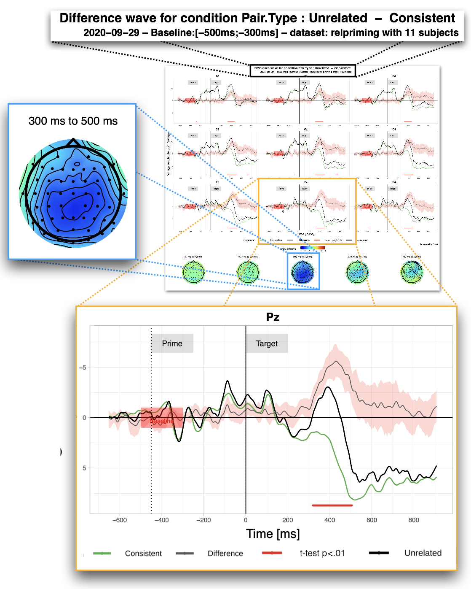

---
authors:
- admin
categories:
- Software
- EEG
- R
date: "2020-12-13T00:00:00Z"
draft: false
featured: false
image:
  caption: ''
  focal_point: ""
  placement: 2
  preview_only: false
lastmod: "2020-12-13T00:00:00Z"
projects: []
subtitle: "An R package to visualize and analyze Event-Related Potential data"
summary: "ERPscope is a new R package that I developped to facilitate the visualization and the exploration of ERP neuroimaging data"
tags:
- Software
- R Package
- Electroencephalography
title: ERPscope
---

## What are ERPs?

ERP or Event-Related Potentials are a neuroimaging technique based on EEG, or electro-encephalography. Electrodes are placed on the scalp to record the electrical activity of the brain in real time. ERP research focuses on the brain's electrical activity in the milliseconds that follows specific events (e.g., presentation of a specific word, picture or sound). Metaphorically, we could compare it to setting up 64 microphones over an arena during a hockey game. The idea is then to infer how does hockey work using the sound recording. For example we notice a big clamour coming from one side of the arena when one of the two teams scores).

## Looking at ERP data

The resulting data for each participants is usually data for hundreds of items for several dozens of electrodes. This data are preprocessed from the continuous recording of the brain's electrical activity (filtering, correction, removal of noise data...) using different existing toolboxes (e.g., Fieldtrip, EEGLab, ERPLab, MNE Python). However, in these toolboxes, it can be a challenge to create customized plots to display these data. Moreover, data are often exported to the R environment to perform advanced statistical modeling. ERPscope was developped with the idea of completing this gap without replacing any other tool.

## Goals of ERPscope: plot and explore

The first goal of ERPscope is to visualize the data through three classic plots:
1. ERP plots 
2. Difference wave plots
3. Voltage maps or topoplots

The second goal is to facilitate data exploration and more specifically:
1. Assess the variability of ERP effects accross participants through correlation plots between ERP effects and external variable
2. Run the same model across different time-windows

More details will come soon. 
The abstract of the preprint of the paper ERPscope can be found below.
Morevoer, ERPscope can be found on GitHub: [www.erpscope.org](http://www.erpscope.org)

## Abstract

A crucial step of scientific research is visualizing the data, which can be especially challenging with multidimensional EEG data. Several toolboxes exist to preprocess EEG data involving different platforms, but their plotting capacities are often limited, difficult to use, or difficult to customize. As many researchers already export their data to the R environment (R Core Team, 2017) in order to run statistical analyses, it would be best to also take full advantage of R’s plotting capabilities. Here we present ERPscope, a freely available R package that makes it easy to visualize, quantify, and statistically analyze ERP data. This user-friendly package allows the creation of ERP graphs and voltage maps with flexible and intuitive customization options. It offers a set of functions to plot ERP waves (plot_erp) and difference waves (plot_difference) for multiple individual electrodes or regions of interest. Both functions can add labels at specific time points (e.g. “target”), plot confidence intervals around the average waveform, indicate the baseline interval used in preprocessing, and apply alternative (simulated) baseline corrections to the data. Graph background, line colors, line types and thickness are easily adjustable for each ERP wave. It is also possible to display the results of a running t-test between two conditions at each electrode along with the ERP difference wave and to plot voltage maps for customized time windows. The function plot_cor_with_erp computes and plots the correlation between an ERP effect in a given time window and an external variable (e.g., performance data) for various scalp regions. Finally, using generate_ERP_stats_table, one can run the same statistical model across different time windows and create an easy-to-read table that highlights significant factors (optionally color-coded according to polarity). ERPscope is compatible with most existing data analysis pipelines. For further details and illustrations, please visit www.erpscope.org.

