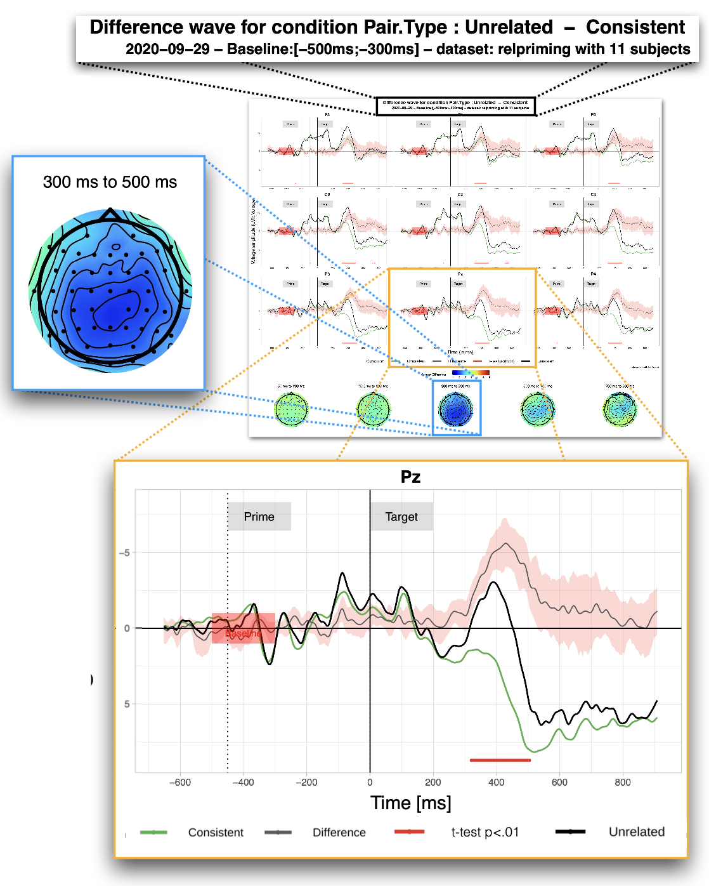

---
authors:
- admin
categories:
- Software
- EEG
- R
date: "2020-12-13T00:00:00Z"
draft: false
featured: false
image:
  caption: ''
  focal_point: ""
  placement: 2
  preview_only: false
lastmod: "2020-12-13T00:00:00Z"
projects: []
subtitle: "Un package R pour visualiser et analyser les données en Potentiels Évoqués (ERP)"
summary: "ERPscope est un nouveau package R que j'ai développé pour faciliter la visualisation et l'exploration des données de neuroimagerie ERP."
tags:
- Logiciel
- Package R 
- Electroencephalographie
title: ERPscope
---

# Que sont les Potentiels Évoqués?

Les Potentiels Évoqués (aussi appelés ERP pour Event-Related Potentials) sont une technique de neuro-imagerie basée sur l'EEG, ou électro-encéphalographie. Des électrodes sont placées sur le cuir chevelu pour enregistrer l'activité électrique du cerveau en temps réel. La recherche sur les ERP se concentre sur l'activité électrique du cerveau dans les millisecondes qui suivent des événements spécifiques (par exemple, la présentation d'un mot, d'une image ou d'un son spécifique). Métaphoriquement, on pourrait comparer cette recherche à l'installation de 64 microphones au-dessus d'une arena pendant un match de hockey. L'idée est ensuite de déduire comment fonctionne le hockey à partir de l'enregistrement sonore. Par exemple, nous pourrions remarquer une grande clameur provenant d'un côté de l'arène lorsqu'une des deux équipes marque un but.

## Visualiser les données ERP

Les données obtenues pour chaque participant sont généralement des données pour des centaines d'items et cela pour plusieurs dizaines d'électrodes. Ces données sont prétraitées à partir de l'enregistrement continu de l'activité électrique du cerveau (filtrage, correction, suppression des données parasites...) à l'aide de différentes boîtes à outils existantes (par exemple, Fieldtrip, EEGLab, ERPLab, ou MNE Python). Cependant, il peut être difficile de créer des graphiques personnalisés pour visualiser ces données dans les boîtes à outils existantes. De plus, les données sont souvent exportées vers l'environnement R pour effectuer des modélisations statistiques avancées. ERPscope a été développé avec l'idée de combler ce manque sans remplacer aucun autre outil.

## Objectifs d'ERPscope: visualiser et explorer

Le premier objectif d'ERPscope est de visualiser les données à travers trois graphiques classiques :
1. Graphiques ERP 
2. Graphiques d'ondes de différence
3. Cartes topgraphiques ERP

Le second objectif est de faciliter l'exploration des données et notamment:
1. Évaluer la variabilité des effets ERP entre les participants grâce à des graphiques de corrélation entre les effets ERP et des variables externes.
2. Exécuter le même modèle statistique dans différentes fenêtres temporelles

Plus de détails seront bientôt disponibles. 
Le résumé du preprint de l'article ERPscope peut être trouvé ci-dessous.
De plus, le code et la documentation d'ERPscope peuvent être trouvés sur GitHub : [www.erpscope.org](http://www.erpscope.org)

## Résumé

Une étape cruciale de la recherche scientifique est la visualisation des données, ce qui peut s'avérer particulièrement difficile avec les données EEG multidimensionnelles. Plusieurs boîtes à outils existent pour prétraiter les données EEG impliquant différentes plateformes, mais la création de graphiques y est souvent limitée, difficile à utiliser ou à personnaliser. Comme de nombreux chercheurs exportent déjà leurs données vers l'environnement R (R Core Team, 2017) afin d'effectuer leurs analyses statistiques, il serait préférable d'exploiter les fortes capacité de R pour la création de graphique. Nous présentons ici ERPscope, un package R librement disponible qui facilite la visualisation, la quantification et l'analyse statistique des données ERP. Ce package ergonomique permet la création de graphiques et de cartes topgraphiques ERP avec des options de personnalisation flexibles et intuitives. Il offre un ensemble de fonctions permettant de tracer les ondes ERP (plot_erp) et les graphiques de différence ERP (plot_difference) pour un ensemble délectrodes individuelles ou de régions d'intérêt. Les deux fonctions peuvent ajouter des étiquettes à des points temporels spécifiques (par exemple, le mot "cible"), tracer des intervalles de confiance autour de la forme d'onde moyenne, indiquer l'intervalle de ligne de base utilisé dans le prétraitement et appliquer des corrections de baselines alternatives (simulées). L'arrrière plan du graphique, les couleurs des lignes, les types de lignes et l'épaisseur sont facilement ajustables pour chaque onde ERP. Il est également possible d'afficher les résultats d'un test-t entre deux conditions à chaque électrode avec l'onde de différence ERP et de tracer des cartes topographiques pour des fenêtres de temps personnalisées. La fonction plot_cor_with_erp calcule et trace la corrélation entre un effet ERP dans une fenêtre temporelle donnée et une variable externe (par exemple, des données de performance) pour diverses régions du cuir chevelu. Enfin, en utilisant generate_ERP_stats_table, on peut exécuter le même modèle statistique sur différentes fenêtres temporelles et créer un tableau facile à lire qui met en évidence les facteurs significatifs (qui peuvent être codés par couleur selon la polarité). ERPscope est compatible avec la plupart des pipelines d'analyse de données existants. Pour plus de détails et d'illustrations, veuillez consulter le site [www.erpscope.com](http://www.erpscope.com).

